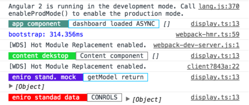

## ng2-logger ##


Logger for TypeScript and JavaScript apps.

You can use this logger in your apps with almost **any**
TS/JS framework including: 

 - Angular2 (https://github.com/AngularClass/angular2-webpack-starter)
 - React Redux (https://github.com/davezuko/react-redux-starter-kit)
 - React Redux TS (https://github.com/jaysoo/todomvc-redux-react-typescript)

See what is going on in your app!
Now chrome console logs are full of colors!



To install package run:

    npm install ng2-logger --save

First import it:

```ts
    import { Log, Level } from 'ng2-logger/ng2-logger'
```

Simple use:

Init your log :
```ts
    const log = Log.create('books'); 
```
or if you wanna just log errors and warnings :
```ts
    const log = Log.create('books', Level.ERROR, Level.WARN); 
```
'books' is current class or anything inside *.ts file.

You can also assign static color to specific module in application:
```ts
    log.color = 'red'; 
```
After inited **log** you are able to start debugging: 
```ts
    log.d('object',obj) // console.log
    log.er('object',obj) // console.error
    log.i('object',obj) // console.info
    log.w('object',obj) // console.warn
```


**Production mode**
-------------------

You will not see anyting in prduction mode:

    // enable production mode in your app
    ...
    Log.setProductionMode();
    ...
    // your app code with console and ng2-logger logs
    

    
It is important to set production mode before any log messages are executed.
This will ensure that log messages that should not be seen are leaked out.


**Selective debug - global settings**
-------------------

Optional specify what you wanna see in yours debug console.
This settings will override settings from files.

```ts
    Log.setProductionMode();
    Log.onlyModules('src:books', 'src:records', 'src:page:login');
    Log.onlyLevel(Level.ERROR,Level.INFO);
```

It is important to note that the placement of global settings are important. It is suggested that placement
of debug settings is prior to `@NgModule`.

**Specifying `onlyModules` as regular expression(s)**
-------------------

In the above example you'll notice `module:books` and `module:records` were specified.
you might be using such syntax for namespace hierarchy etc. You may also pass in one or more regular
expression string(s) to the `onlyModule` function to specify a selection of modules you wish
to show, for instances those whose name begins with `src`:

```ts

    Log.onlyModules('^src');
```


